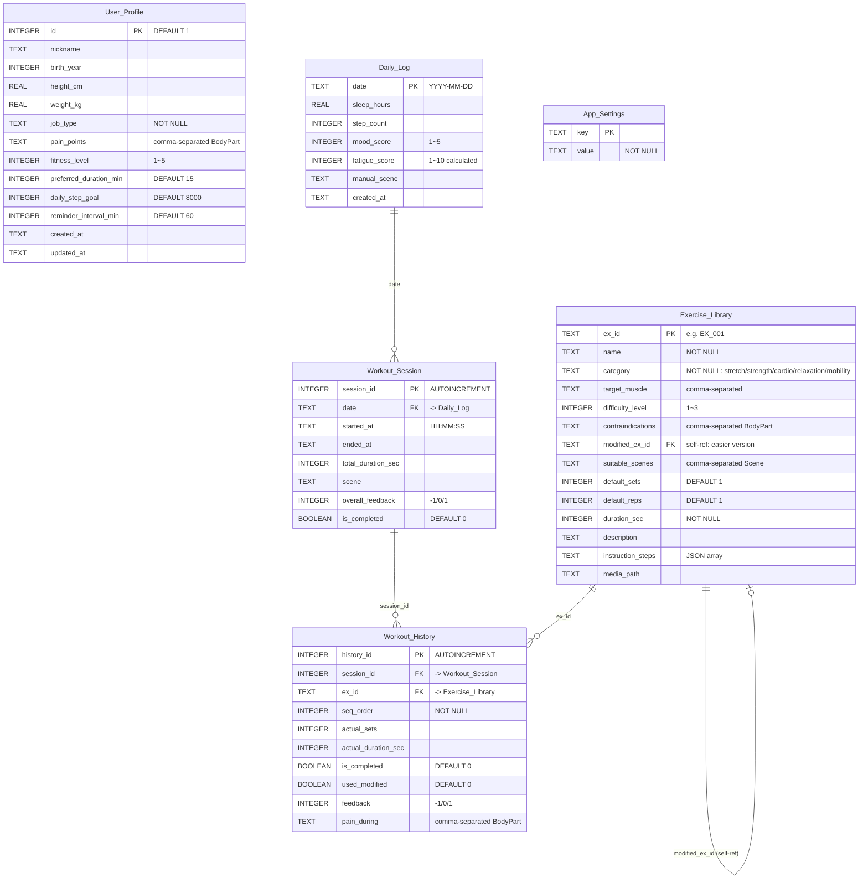

# 데이터베이스 설계 명세서

**프로젝트**: Team LinkUp 
**문서 버전**: v1.0  
**최종 수정일**: 2026-04-03  

---

## 목차

1. [개발 환경 및 협업 가이드](#1-개발-환경-및-협업-가이드)
2. [파일 구조 및 초기화 절차](#2-파일-구조-및-초기화-절차)
3. [ER 다이어그램](#3-er-다이어그램)
4. [테이블 상세 명세](#4-테이블-상세-명세)
5. [Enum 표준화 규칙](#5-enum-표준화-규칙)
6. [트리거 및 인덱스](#6-트리거-및-인덱스)
7. [시스템 Flowchart와의 매핑](#7-시스템-flowchart와의-매핑)
8. [팀원별 참고 사항](#8-팀원별-참고-사항)
9. [향후 확장 가이드](#9-향후-확장-가이드)

---

## 1. 개발 환경 및 협업 가이드

### 1.1 팀원 간 DB 공유 방식

| 공유 대상                      | 방식                 | 관리 규칙                        |
| -------------------------- | ------------------ | ---------------------------- |
| `schema.sql`               | Git으로 버전 관리        | DB 담당자가 관리. 수정 시 PR 필수.      |
| `seed_data.sql`            | Git으로 버전 관리        | DB 담당자 관리. 동작 추가 시 PR.       |
| `triggers_and_indexes.sql` | Git으로 버전 관리        | DB 담당자 관리.                   |
| `constants.py`             | Git으로 버전 관리        | **전 멤버 공용**. 수정 시 전원 합의 필요.  |
| `app.db` (런타임 생성 파일)       | **.gitignore에 추가** | 각자 로컬에서 생성. 절대 Git에 올리지 말 것. |

### 1.2 권장: GitHub 저장소 구조


```
linkup/
├── db/
│   ├── schema.sql                ← 테이블 생성 DDL
│   ├── triggers_and_indexes.sql  ← 트리거 & 인덱스
│   ├── seed_data.sql             ← 운동 동작 초기 데이터 (44개)
│   └── er_diagram.dbml           ← ER 다이어그램 (dbdiagram.io 호환)
│
├── src/
│   ├── constants.py              ← Enum 정의 (전 멤버 공용)
│   ├── db_manager.py             ← DB 초기화 & 연결 관리 (백엔드)
│   ├── dao/                      ← Data Access Object 계층 (백엔드)
│   │   ├── user_dao.py
│   │   ├── exercise_dao.py
│   │   ├── daily_log_dao.py
│   │   ├── session_dao.py
│   │   └── history_dao.py
│   ├── engine/                   ← 핵심 알고리즘 (백엔드)
│   │   ├── pain_filter.py
│   │   ├── adaptive_scheduler.py
│   │   └── routine_generator.py
│   └── ui/                       ← PyQt6 UI 파일 (프론트엔드)
│
├── media/                        ← 운동 동작 GIF/영상 파일
├── .gitignore                    ← app.db, __pycache__ 등 제외
└── README.md
```

---

## 2. 파일 구조 및 초기화 절차

### 2.1 DB 파일 목록

| 파일                         | 역할                            | 실행 순서       |
| -------------------------- | ----------------------------- | ----------- |
| `schema.sql`               | 모든 테이블 생성 (DDL)               | **1번**      |
| `triggers_and_indexes.sql` | 트리거 및 인덱스 생성                  | **2번**      |
| `seed_data.sql`            | 운동 동작 라이브러리 초기 데이터 삽입         | **3번**      |
| `constants.py`             | Python Enum 정의 (프론트엔드/백엔드 공용) | 코드에서 import |

### 2.2 앱 첫 실행 시 초기화 흐름

백엔드 담당자가 `db_manager.py`에 아래 로직을 구현해야 합니다:

```
앱 시작
  ├─ app.db 파일이 존재하는가?
  │    ├─ NO  → schema.sql 실행
  │    │         → triggers_and_indexes.sql 실행
  │    │         → seed_data.sql 실행
  │    │         → 초기화 완료
  │    └─ YES → App_Settings에서 db_version 확인
  │              ├─ 최신 버전 → 그대로 사용
  │              └─ 구 버전   → 마이그레이션 스크립트 실행
  └─ 정상 가동
```

### 2.3 로컬에서 테스트용 DB 생성 (터미널)

```bash
# 1단계: DB 생성 및 테이블 초기화
sqlite3 app.db < schema.sql

# 2단계: 트리거 & 인덱스 적용
sqlite3 app.db < triggers_and_indexes.sql

# 3단계: 운동 동작 데이터 삽입
sqlite3 app.db < seed_data.sql

# 확인
sqlite3 app.db "SELECT COUNT(*) FROM Exercise_Library;"
# → 44
```

---

## 3. ER 다이어그램

### 3.1 보는 방법

두 가지 형식을 제공합니다. **둘 중 편한 것을 사용하세요.**

| 형식 | 파일 | 사용 방법 |
|------|------|-----------|
| **dbdiagram.io** (권장) | `er_diagram.dbml` | https://dbdiagram.io/d 접속 → 왼쪽 편집기에 내용 붙여넣기 → 자동 렌더링 |
| **Mermaid** | `er_diagram.mermaid` | GitHub에서 자동 렌더링 / Mermaid Live Editor 사용 |



### 3.2 핵심 관계 요약

```
User_Profile ─(pain_points 텍스트 매칭)─► Exercise_Library
                                              │
                                              │ self-reference
                                              ▼
                                         modified_ex_id
                                              │
Exercise_Library ◄──(ex_id)── Workout_History
                                    │
                                    │ FK: session_id
                                    ▼
                              Workout_Session
                                    │
                                    │ FK: date
                                    ▼
                                Daily_Log

App_Settings (독립 테이블, FK 없음)
```

**핵심 데이터 흐름**:  
`Daily_Log` → `Workout_Session` → `Workout_History` → `Exercise_Library`

- 하루에 여러 번 운동 가능 → `Daily_Log : Workout_Session = 1 : N`
- 한 세션에 여러 동작 수행 → `Workout_Session : Workout_History = 1 : N`
- 하나의 동작이 여러 기록에 등장 → `Exercise_Library : Workout_History = 1 : N`

---

## 4. 테이블 상세 명세

### 4.1 User_Profile (사용자 프로필)

> 로컬 단일 사용자 앱이므로, 이 테이블에는 항상 **1개의 행만 존재**합니다 (id=1).

| 컬럼 | 타입 | 제약                          | 설명 |
|------|------|------|------|
| `id` | INTEGER | PK, DEFAULT 1               | 고정값 1 |
| `nickname` | TEXT |                             | 사용자 닉네임 (UI 표시용) |
| `birth_year` | INTEGER |                             | 출생 연도. 연령대별 운동 안전 기준 적용 가능. |
| `height_cm` | REAL |                             | 키 (cm). 선택 입력. |
| `weight_kg` | REAL |                             | 체중 (kg). 선택 입력. BMI는 백엔드에서 계산 (DB 미저장). |
| `job_type` | TEXT | NOT NULL, DEFAULT 'student' | 직업 유형. `JobType` enum 값만 허용. |
| `pain_points` | TEXT | DEFAULT ''                  | **핵심 필드**. 현재 통증 부위 목록 (쉼표 구분). `BodyPart` enum 값만 허용. 예: `"neck,lower_back,wrist"` |
| `fitness_level` | INTEGER | NOT NULL, CHECK(1~5)        | 체력 자가평가. 1=매우 약함, 5=매우 강함. 초기 추천 난이도 결정. |
| `preferred_duration_min` | INTEGER | DEFAULT 15                  | 1회 운동 선호 시간 (분). 루틴 생성 시 총 시간 제어용. |
| `daily_step_goal` | INTEGER | DEFAULT 8000                | 일일 목표 걸음 수. 피로도 계산에 활용. |
| `reminder_interval_min` | INTEGER | DEFAULT 60                  | 장시간 좌식 알림 간격 (분). PyQt `QTimer` 연동. |
| `created_at` | TEXT | DEFAULT datetime            | 계정 생성 시각 |
| `updated_at` | TEXT | DEFAULT datetime            | 최종 수정 시각. **트리거로 자동 갱신**됨. |

**프론트엔드 참고**: 앱 최초 실행 시 온보딩 화면에서 `job_type`, `pain_points`, `fitness_level`, `preferred_duration_min`을 입력받아야 합니다.

---

### 4.2 Exercise_Library (운동 동작 라이브러리)

> 정적 데이터로 앱과 함께 배포됩니다. 현재 **44개 동작**이 등록되어 있습니다.

| 컬럼                  | 타입      | 제약                   | 설명                                                                                                                                                                 |
| ------------------- | ------- | -------------------- | ------------------------------------------------------------------------------------------------------------------------------------------------------------------ |
| `ex_id`             | TEXT    | PK                   | 동작 고유 ID. 예: `'EX_001'`                                                                                                                                            |
| `name`              | TEXT    | NOT NULL             | 동작 이름. 예: `'목 전방 굴곡 스트레칭'`                                                                                                                                         |
| `category`          | TEXT    | NOT NULL, CHECK      | **운동 분류**. `ExerciseCategory` enum: `stretch` / `strength` / `cardio` / `relaxation` / `mobility`. Adaptive Scheduler에서 피로도 높을 때 `stretch`/`relaxation` 우선 추천에 필수. |
| `target_muscle`     | TEXT    | NOT NULL             | 대상 근육군 (쉼표 구분). 예: `"neck,shoulder"`                                                                                                                               |
| `difficulty_level`  | INTEGER | NOT NULL, CHECK(1~3) | 난이도. 1=낮음, 2=보통, 3=높음.                                                                                                                                             |
| `contraindications` | TEXT    | DEFAULT ''           | **금기 부위** (쉼표 구분). `BodyPart` enum 값만 사용. 사용자의 `pain_points`와 교집합이 있으면 해당 동작은 **Pain-Filter에 의해 제외**됨.                                                             |
| `modified_ex_id`    | TEXT    | FK → self            | **난이도 하향 대체 동작**의 ex_id. 사용자가 "너무 어려워요" 버튼 클릭 시 이 동작으로 전환. NULL이면 대체 동작 없음.                                                                                        |
| `suitable_scenes`   | TEXT    | NOT NULL             | 적합 장소 (쉼표 구분). `Scene` enum: `office` / `home`.                                                                                                                   |
| `default_sets`      | INTEGER | DEFAULT 1            | 기본 세트 수. Adaptive Scheduler가 피로도에 따라 감소 가능.                                                                                                                        |
| `default_reps`      | INTEGER | DEFAULT 1            | 세트당 기본 반복 횟수.                                                                                                                                                      |
| `duration_sec`      | INTEGER | NOT NULL             | 1회 동작 소요 시간 (초). 루틴 생성 시 시간 합산에 사용. 1세트의 순수 실행 시간 (휴식 제외). 자세한 시간 계산 규칙은 요구사항 분석서 §7.1 BR-01 참조.                                                                   |
| `description`       | TEXT    |                      | 동작 간단 설명 (1~2문장). UI에서 GIF 아래에 표시.                                                                                                                                 |
| `instruction_steps` | TEXT    |                      | 단계별 안내. **JSON 배열 형식** 문자열. 예: `'["1단계...", "2단계..."]'`. 백엔드에서 `json.loads()`로 파싱.                                                                                 |
| `media_path`        | TEXT    |                      | 로컬 GIF/동영상 상대 경로. 예: `'media/ex_001.gif'`                                                                                                                          |

**modified_ex_id 관계도** (자기 참조 FK):

```
EX_005 (목 등척성, 난이도2) ──→ EX_003 (목 회전, 난이도1)
EX_009 (벽 천사, 난이도2)   ──→ EX_007 (어깨 돌리기, 난이도1)
EX_010 (어깨 외회전, 난이도2) ──→ EX_008 (팔 교차 스트레칭, 난이도1)
EX_011 (고양이-소, 난이도2)  ──→ EX_013 (앉아서 등 스트레칭, 난이도1)
EX_014 (슈퍼맨, 난이도3)    ──→ EX_011 (고양이-소, 난이도2)
EX_017 (글루트 브릿지, 난이도2) ──→ EX_015 (골반 틸트, 난이도1)
EX_018 (데드버그, 난이도2)   ──→ EX_016 (무릎 가슴 당기기, 난이도1)
EX_029 (맨몸 스쿼트, 난이도2) ──→ EX_028 (앉아서 다리 펴기, 난이도1)
EX_030 (벽 스쿼트, 난이도2)  ──→ EX_031 (벽 미니 스쿼트, 난이도1)
EX_036 (점핑잭, 난이도2)    ──→ EX_035 (제자리 걷기, 난이도1)
EX_037 (하이 니, 난이도2)   ──→ EX_035 (제자리 걷기, 난이도1)
```

---

### 4.3 Daily_Log (일일 상태 기록)

> 하루에 1개의 행만 존재합니다. 사용자가 앱을 열 때 그날의 상태를 입력하면 생성됩니다.

| 컬럼 | 타입 | 제약 | 설명 |
|------|------|------|------|
| `date` | TEXT | PK | 날짜. **반드시 `YYYY-MM-DD` 형식** 준수. 예: `'2026-04-03'` |
| `sleep_hours` | REAL | | 전날 밤 수면 시간 (시간 단위). 예: `6.5` |
| `step_count` | INTEGER | | 오늘 걸음 수 (사용자 수동 입력) |
| `mood_score` | INTEGER | CHECK(1~5) | 오늘 컨디션 자가평가. 1=매우 나쁨, 5=매우 좋음. |
| `fatigue_score` | INTEGER | CHECK(1~10) | **백엔드가 계산하여 저장**하는 피로도 점수. sleep_hours + step_count + mood_score 종합. |
| `manual_scene` | TEXT | | 사용자가 수동 선택한 장소. `Scene` enum 값. |
| `created_at` | TEXT | DEFAULT datetime | 기록 생성 시각 |

**중요**: `fatigue_score`는 사용자가 직접 입력하지 않습니다. 백엔드가 나머지 필드를 기반으로 계산한 뒤 UPDATE합니다.

---

### 4.4 Workout_Session (운동 세션)

> "한 번의 운동"을 의미합니다. 하루에 여러 세션이 가능합니다 (점심 운동, 퇴근 후 운동 등).

| 컬럼 | 타입 | 제약 | 설명 |
|------|------|------|------|
| `session_id` | INTEGER | PK, AUTOINCREMENT | 자동 증가 고유 ID |
| `date` | TEXT | FK → Daily_Log(date), NOT NULL | 세션 날짜. **해당 날짜의 Daily_Log가 먼저 존재해야** 삽입 가능 (트리거로 강제). |
| `started_at` | TEXT | NOT NULL | 세션 시작 시각. `HH:MM:SS` 형식. |
| `ended_at` | TEXT | | 세션 종료 시각. **값이 설정되면 트리거가 자동으로 total_duration_sec를 계산**합니다. |
| `total_duration_sec` | INTEGER | | 총 소요 시간 (초). 트리거로 자동 계산. |
| `scene` | TEXT | | 이번 운동 장소 |
| `overall_feedback` | INTEGER | CHECK(-1/0/1) | 전체 난이도 피드백. -1=어려움, 0=적당, 1=쉬움. |
| `is_completed` | BOOLEAN | DEFAULT 0 | 추천 루틴 전체 완료 여부 |

**이 테이블이 필요한 이유**: 이전 설계에서는 `Workout_History`가 `date`에 직접 연결되어 있어서 "하루에 여러 번 운동"이나 "이 동작들이 한 세트로 추천된 것"을 표현할 수 없었습니다.

---

### 4.5 Workout_History (동작별 수행 기록)

> 세션 내 개별 동작의 수행 결과를 기록합니다. 피드백 루프(폐쇄 루프)의 핵심 데이터입니다.

| 컬럼 | 타입 | 제약 | 설명 |
|------|------|------|------|
| `history_id` | INTEGER | PK, AUTOINCREMENT | 자동 증가 고유 ID |
| `session_id` | INTEGER | FK → Workout_Session, NOT NULL | 소속 세션 |
| `ex_id` | TEXT | FK → Exercise_Library, NOT NULL | 수행한 동작 ID |
| `seq_order` | INTEGER | NOT NULL | 세션 내 수행 순서 (1, 2, 3...) |
| `actual_sets` | INTEGER | | 실제 수행 세트 수 (Exercise_Library의 default_sets와 비교 가능) |
| `actual_duration_sec` | INTEGER | | 실제 소요 시간 (초) |
| `is_completed` | BOOLEAN | DEFAULT 0 | 해당 동작 완료 여부 |
| `used_modified` | BOOLEAN | DEFAULT 0 | 운동 중 "난이도 하향" 버튼을 눌러 대체 동작으로 전환했는지 여부 |
| `feedback` | INTEGER | CHECK(-1/0/1) | 동작별 난이도 피드백. -1=어려움, 0=적당, 1=쉬움. |
| `pain_during` | TEXT | DEFAULT '' | **운동 중 새로 발생한 통증 부위** (쉼표 구분). 백엔드가 이 값을 분석하여 `User_Profile.pain_points` 업데이트를 제안할 수 있음. |

---

### 4.6 App_Settings (앱 설정)

> Key-Value 형태의 범용 설정 테이블. 사용자 건강 데이터와는 무관합니다.

| 컬럼 | 타입 | 제약 | 설명 |
|------|------|------|------|
| `key` | TEXT | PK | 설정 항목 이름 |
| `value` | TEXT | NOT NULL | 설정 값 (문자열) |

**기본 초기 데이터**:

| key | value | 용도 |
|-----|-------|------|
| `theme` | `light` | UI 테마 (light / dark) |
| `language` | `ko` | 앱 언어 |
| `onboarding_completed` | `false` | 온보딩(초기 설정) 완료 여부 |
| `db_version` | `1` | DB 스키마 버전. 향후 마이그레이션 시 확인용. |

---

## 5. Enum 표준화 규칙

### 왜 필요한가?

`pain_points`와 `contraindications`는 텍스트 매칭으로 필터링합니다.  
만약 한쪽은 `"low_back"`, 다른 쪽은 `"lower_back"`이라고 쓰면 **필터링이 실패**합니다.

이를 방지하기 위해 `constants.py`에 모든 허용 값을 Enum으로 정의하고, **프론트엔드/백엔드 모두 이 파일을 기준으로 작동**합니다.

### 정의된 Enum 목록

| Enum 클래스 | 용도 | 값 목록 |
|-------------|------|---------|
| `BodyPart` | pain_points, contraindications, target_muscle | neck, shoulder, upper_back, lower_back, wrist, knee, ankle, hip, elbow, eye |
| `ExerciseCategory` | category | stretch, strength, cardio, relaxation, mobility |
| `Scene` | suitable_scenes, manual_scene | office, home |
| `JobType` | job_type | it, office_worker, student, manual_labor, other |

### 사용 예시

```python
from constants import BodyPart, ExerciseCategory

# 프론트엔드: 드롭다운 메뉴 옵션 생성
for value, label in BodyPart.choices_ko():
    dropdown.addItem(label, value)
    # ("목", "neck"), ("어깨", "shoulder"), ...

# 백엔드: 입력 검증
from constants import validate_pain_points
assert validate_pain_points("neck,lower_back")   # True
assert not validate_pain_points("neck,low_back")  # False — 잘못된 값
```

---

## 6. 트리거 및 인덱스

### 6.1 트리거 (Triggers)

| 이름                              | 대상 테이블          | 발동 조건                       | 동작                                                                      |
| ------------------------------- | --------------- | --------------------------- | ----------------------------------------------------------------------- |
| `trg_user_profile_updated_at`   | User_Profile    | UPDATE 시                    | `updated_at`을 현재 시각으로 자동 갱신                                             |
| `trg_session_calc_duration`     | Workout_Session | `ended_at`이 NULL → 값으로 변경 시 | `started_at`과 `ended_at`의 차이를 계산하여 `total_duration_sec`에 자동 저장          |
| `trg_session_require_daily_log` | Workout_Session | INSERT 전                    | 해당 날짜의 `Daily_Log` 행이 없으면 삽입을 거부. **"일일 상태를 먼저 입력하세요"** 로직을 DB 레벨에서 강제. |

### 6.2 인덱스 (Indexes)

| 이름 | 대상 | 용도 |
|------|------|------|
| `idx_session_date` | Workout_Session(date) | "오늘의 운동 세션 조회" 가속 |
| `idx_history_session` | Workout_History(session_id) | "세션 X의 모든 동작 조회" 가속 |
| `idx_exercise_category` | Exercise_Library(category) | 카테고리별 필터링 가속 |
| `idx_exercise_difficulty` | Exercise_Library(difficulty_level) | 난이도별 필터링 가속 |
| `idx_exercise_cat_diff` | Exercise_Library(category, difficulty_level) | "쉬운 스트레칭 동작만 조회" 등 복합 쿼리 가속 |

### 6.3 반드시 지켜야 할 SQLite 설정

**백엔드 담당자가 DB 연결 시 매번 아래 두 줄을 실행해야 합니다:**

```python
import sqlite3

conn = sqlite3.connect("app.db")
conn.execute("PRAGMA foreign_keys = ON;")   # SQLite는 기본값이 OFF!
conn.execute("PRAGMA journal_mode = WAL;")  # 읽기/쓰기 동시성 향상
```

이 설정을 빠뜨리면 **외래 키 제약이 무시**되어 잘못된 데이터가 삽입될 수 있습니다.

---

## 7. 시스템 Flowchart와의 매핑

제안서의 Flowchart 각 단계가 어떤 테이블/컬럼과 연동되는지를 정리합니다.

### 단계 1: 데이터 입력 (데이터 수집)

```
사용자 입력 → Daily_Log INSERT
  ├─ sleep_hours  (어젯밤 수면 시간)
  ├─ step_count   (오늘 걸음 수)
  └─ mood_score   (오늘 컨디션)

시스템 읽기 → User_Profile SELECT
  ├─ pain_points  (통증 부위)
  ├─ fitness_level (체력 수준)
  └─ preferred_duration_min (운동 시간)
```

### 단계 2: Pain-Filter Engine (통증 필터링)

```
IF pain_points가 비어있지 않다면:
    Exercise_Library에서 조회 시,
    contraindications와 pain_points의 교집합이 있는 동작을 제거

    Python/Pandas 로직:
    user_pains = set(pain_points.split(","))
    safe = exercises[exercises['contraindications'].apply(
        lambda c: user_pains.isdisjoint(set(c.split(","))) if c else True
    )]
```

### 단계 3: Adaptive Scheduler (적응형 스케줄러)

```
백엔드가 fatigue_score 계산 → Daily_Log UPDATE

IF fatigue_score >= 7 (높은 피로도):
    ① category를 'stretch' 또는 'relaxation'으로 제한
    ② difficulty_level = 1인 동작만 선택
    ③ default_sets를 1로 감소

IF fatigue_score <= 3 (낮은 피로도):
    ① 모든 category 허용
    ② difficulty_level 제한 없음 (fitness_level에 따라)
```

### 단계 4: 루틴 생성

```
필터링된 동작 풀에서,
preferred_duration_min 이내로 동작을 조합

→ Workout_Session INSERT (date, started_at, scene)
→ Workout_History INSERT × N (session_id, ex_id, seq_order)
```

### 단계 5: 운동 진행 중 즉시 난이도 하향

```
사용자가 "너무 어려워요 / 통증이 있어요" 버튼 클릭:

→ 현재 ex_id의 modified_ex_id 조회
→ UI에서 GIF를 대체 동작으로 교체
→ Workout_History UPDATE: used_modified = 1
```

### 단계 6: 운동 완료 & 피드백

```
→ Workout_History UPDATE: is_completed, feedback, pain_during
→ Workout_Session UPDATE: ended_at (→ 트리거가 total_duration_sec 자동 계산)
→ Workout_Session UPDATE: overall_feedback, is_completed

IF pain_during에 새로운 부위가 있다면:
    → 사용자에게 "이 부위를 통증 목록에 추가할까요?" 다이얼로그 표시
    → 확인 시 User_Profile.pain_points UPDATE
```

---

## 8. 팀원별 참고 사항

### 8.1 백엔드 담당자에게

**① DAO 패턴 사용을 권장합니다**

각 테이블에 대응하는 DAO 클래스를 만들어 SQL을 캡슐화하세요.  
비즈니스 로직 코드에서 직접 SQL을 작성하면 유지보수가 매우 어려워집니다.

```python
# dao/exercise_dao.py — 예시
class ExerciseDAO:
    def __init__(self, conn):
        self.conn = conn

    def get_all(self):
        return pd.read_sql("SELECT * FROM Exercise_Library", self.conn)

    def get_by_id(self, ex_id):
        cur = self.conn.execute(
            "SELECT * FROM Exercise_Library WHERE ex_id = ?", (ex_id,)
        )
        return cur.fetchone()

    def get_modified(self, ex_id):
        cur = self.conn.execute(
            "SELECT modified_ex_id FROM Exercise_Library WHERE ex_id = ?",
            (ex_id,)
        )
        row = cur.fetchone()
        return row[0] if row else None
```

**② fatigue_score 계산 공식 (참고용)**

```python
def calc_fatigue(sleep_hours, step_count, mood_score, step_goal=8000):
    sleep_factor = max(0, (7.0 - (sleep_hours or 7.0))) * 1.5
    step_ratio = (step_count or 0) / step_goal if step_goal > 0 else 0
    step_factor = max(0, (1.0 - step_ratio)) * 2.0
    mood_factor = (5 - (mood_score or 3)) * 0.8
    raw = sleep_factor + step_factor + mood_factor
    return min(10, max(1, round(raw)))
```

**③ Pain-Filter 구현 시 주의점**

- `contraindications`가 빈 문자열(`''`)인 동작은 누구에게든 안전합니다. 무조건 통과.
- `pain_points`가 빈 문자열이면 필터링 자체를 건너뛰면 됩니다.
- 비교 시 반드시 `constants.py`의 `parse_csv()` 함수로 파싱한 뒤 `set` 비교를 하세요.  
  단순 문자열 `in` 검사는 `"back" in "upper_back"` → True 같은 오탐이 발생합니다.

**④ DB 연결 시 PRAGMA 잊지 마세요**

```python
conn = sqlite3.connect("app.db")
conn.execute("PRAGMA foreign_keys = ON;")
conn.execute("PRAGMA journal_mode = WAL;")
```

---

### 8.2 프론트엔드 담당자에게

**① 드롭다운/체크박스 데이터는 constants.py에서 가져오세요**

```python
from constants import BodyPart, JobType, Scene

# PyQt6 콤보박스 예시
for value, label_ko in JobType.choices_ko():
    combo_box.addItem(label_ko, value)
```

하드코딩하면 나중에 enum 값이 추가될 때 UI만 빠지는 문제가 생깁니다.

**② 운동 실행 화면의 데이터 흐름**

```
┌─────────────────────────────────────────┐
│  운동 실행 화면                          │
│                                         │
│  [GIF 영역]  ← media_path              │
│                                         │
│  동작 이름   ← name                     │
│  설명       ← description               │
│  단계 안내   ← instruction_steps (JSON)  │
│  세트/횟수   ← default_sets × default_reps│
│  남은 시간   ← duration_sec              │
│                                         │
│  [이전] [너무 어려워요] [완료] [다음]      │
│                                         │
│  "너무 어려워요" 클릭 시:               │
│    → 백엔드에 modified_ex_id 요청        │
│    → 새 동작으로 GIF 및 정보 교체        │
│    → Workout_History.used_modified = 1   │
└─────────────────────────────────────────┘
```

**③ 장시간 좌식 알림**

`User_Profile.reminder_interval_min` 값을 읽어서 PyQt의 `QTimer`로 알림을 구현하세요:

```python
from PyQt6.QtCore import QTimer

timer = QTimer()
timer.timeout.connect(show_reminder_popup)
interval_ms = user_profile["reminder_interval_min"] * 60 * 1000
timer.start(interval_ms)
```

---

### 8.3 팀장에게

**① 운동 동작 GIF 파일 준비가 필요합니다**

현재 `seed_data.sql`에 44개 동작이 등록되어 있으며 각각의 `media_path`에 대응하는 GIF 파일이 필요합니다.  
파일 목록은 아래 명령으로 확인 가능합니다:

```bash
sqlite3 app.db "SELECT ex_id, name, media_path FROM Exercise_Library;"
```

GIF를 직접 제작하기 어려우면, 초기에는 정적 이미지 + 텍스트 설명(`description`, `instruction_steps`)으로 대체하는 방안도 고려하세요.

**② seed_data의 지속적 보강이 필요합니다**

현재 44개 동작은 MVP(Minimum Viable Product) 수준입니다.  
발표/시연 전까지 부위별 균형을 맞추고, 특히 `modified_ex_id` 체인이 없는 난이도 2~3 동작에 대해 대체 동작을 보충하는 것이 좋습니다.

**③ 마일스톤 제안**

| 단계          | 완료 기준                                    |
| ----------- | ---------------------------------------- |
| M1: DB 확정   | schema + seed 실행 후 44개 동작 정상 조회          |
| M2: 기본 흐름   | 온보딩 → Daily_Log 입력 → Pain-Filter → 루틴 표시 |
| M3: 운동 실행   | GIF 재생 + 난이도 하향 + 피드백 저장                 |
| M4: 통계/대시보드 | 주간 운동 기록, 완료율, 연속 운동일 표시                 |

---

## 9. 향후 확장 가이드

이 DB 설계는 향후 요구사항 변경에 유연하게 대응할 수 있도록 만들어졌습니다.

### 9.1 테이블 컬럼 추가 시

SQLite의 `ALTER TABLE`로 컬럼을 추가하고, `App_Settings`의 `db_version`을 올립니다:

```sql
-- 예: 운동 시 심박수 기록 추가
ALTER TABLE Workout_History ADD COLUMN heart_rate INTEGER;

-- 버전 업데이트
UPDATE App_Settings SET value = '2' WHERE key = 'db_version';
```

### 9.2 새로운 통증 부위 추가 시

1. `constants.py`의 `BodyPart` enum에 값 추가
2. `seed_data.sql`에 해당 부위 관련 동작 추가
3. 기존 동작의 `contraindications`에 필요 시 새 부위 추가

### 9.3 향후 온라인 기능 확장 시

만약 추후 클라우드 동기화나 다중 사용자를 지원해야 한다면:

- `User_Profile`에 `uuid` 필드 추가
- SQLite → PostgreSQL/MySQL 마이그레이션 스크립트 작성
- `App_Settings`에 `sync_enabled`, `last_synced_at` 등 추가

현재 설계에서 SQL 문법이 표준 SQL에 가깝게 작성되어 있으므로, 마이그레이션 비용은 낮습니다.

---

## 부록: 빠른 참조 카드

### A. 테이블 간 관계 요약

| 부모 테이블 | 자식 테이블 | FK 컬럼 | 관계 |
|------------|------------|---------|------|
| Daily_Log | Workout_Session | date | 1 : N |
| Workout_Session | Workout_History | session_id | 1 : N |
| Exercise_Library | Workout_History | ex_id | 1 : N |
| Exercise_Library | Exercise_Library | modified_ex_id | 자기 참조 |

### B. 자주 사용되는 쿼리 예시

```sql
-- 오늘의 모든 운동 기록 조회
SELECT s.session_id, s.started_at, h.seq_order, e.name, h.is_completed
  FROM Workout_Session s
  JOIN Workout_History h ON s.session_id = h.session_id
  JOIN Exercise_Library e ON h.ex_id = e.ex_id
 WHERE s.date = '2026-04-03'
 ORDER BY s.session_id, h.seq_order;

-- 최근 7일 운동 완료율
SELECT s.date,
       COUNT(h.history_id) AS total,
       SUM(h.is_completed) AS completed,
       ROUND(100.0 * SUM(h.is_completed) / COUNT(h.history_id), 1) AS pct
  FROM Workout_Session s
  JOIN Workout_History h ON s.session_id = h.session_id
 WHERE s.date >= date('now', '-7 days')
 GROUP BY s.date;

-- 사무실에서 할 수 있는, 목 통증 안전한, 쉬운 스트레칭
SELECT ex_id, name, duration_sec
  FROM Exercise_Library
 WHERE suitable_scenes LIKE '%office%'
   AND category = 'stretch'
   AND difficulty_level = 1
   AND (contraindications = '' OR contraindications NOT LIKE '%neck%');

-- 연속 운동일 수 계산
SELECT COUNT(DISTINCT date) AS streak
  FROM Workout_Session
 WHERE date >= (
     SELECT MAX(gap_start) FROM (
         SELECT date(d.date, '+1 day') AS gap_start
           FROM Daily_Log d
          WHERE NOT EXISTS (
                SELECT 1 FROM Workout_Session ws WHERE ws.date = date(d.date, '+1 day')
          )
     )
 );
```

---

*이 문서는 프로젝트 진행 중 수정 및 보강될 수 있습니다.*
