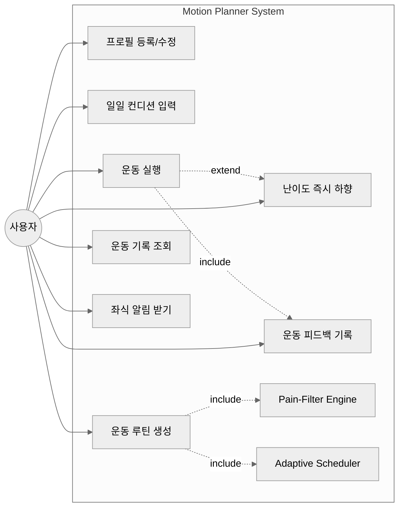

# 요구사항 분석서 (Requirement Analysis)

**프로젝트명**: Motion Planner — 통증·컨디션 기반 맞춤형 운동 루틴 생성기
**팀명**: Team LinkUp
**문서 버전**: v1.0
**작성일**: 2026-04-11
**제출 마감**: 2026-04-14

---

## 0. 팀 구성

| 이름 | 역할 |
|------|------|
| 김이경 | 역할 분담 진행 중 |
| 김동민 | 역할 분담 진행 중 |
| 딩 정 | Database 설계 및 관리 |
| 정성용 | 역할 분담 진행 중 |

> 본 문서는 프로젝트 진행에 따라 v1.1 이후 갱신될 수 있습니다.

---

## 1. 문서 개요

### 1.1 목적

본 문서는 Team LinkUp이 개발하는 데스크톱 애플리케이션 **Motion Planner**의 요구사항을 정의합니다. 사용자가 누구인지, 어떤 방식으로 요구사항을 수집했는지, 이를 어떻게 검증할 것인지, 그리고 어떤 품질 특성을 보장할 것인지를 명시함으로써 향후 설계·구현·테스트 단계의 기준점을 제공합니다.

### 1.2 범위

본 문서는 다음 네 가지 핵심 항목을 반드시 포함합니다.

1. 실제 사용자(고객) 식별
2. 요구사항 수집 방법
3. 요구사항 검증을 위한 테스트 케이스 개발 방법
4. 고려된 품질 특성(Quality Attributes)

추가로 기능 요구사항, 비기능 요구사항, 데이터 요구사항, 유스케이스 다이어그램을 포함합니다.

### 1.3 프로젝트 개요

오랜 좌식 생활로 인한 VDT(Visual Display Terminal) 증후군 — 거북목, 손목터널 증후군, 요추 통증 등 — 을 완화하기 위한 **개인 맞춤형 운동 루틴 생성 데스크톱 앱**입니다. 사용자의 통증 부위, 체력 수준, 일일 컨디션(수면, 걸음 수, 기분)을 입력받아 부상 위험이 있는 동작은 자동으로 제외(Pain-Filter Engine)하고, 피로도에 따라 강도를 동적으로 조절(Adaptive Scheduler)한 루틴을 즉시 제시합니다.

---

## 2. 실제 사용자 식별 (Required Item 1)

> **"Requirements come from users (customers), so you must verify who the actual users are."**

### 2.1 1차 사용자 (Primary Users)

본 앱의 직접적인 사용자는 다음과 같이 식별되었습니다.

| 사용자 그룹 | 특징 | 핵심 Pain Point |
|------------|------|----------------|
| **20~30대 사무직 직장인** | 하루 8시간 이상 책상 앞 근무, IT/사무직 종사자 | 거북목, 어깨 결림, 손목터널 증후군. 체육관 갈 시간·체력 부족. |
| **대학생 (재택 학습자 포함)** | 장시간 앉아서 강의 수강·과제 수행 | 허리·목 통증, 운동 경험 부족, 1:1 PT 비용 부담. |
| **운동 초보자** | 운동 경험이 거의 없으며, 일반 홈트 영상을 따라 하다 부상 경험이 있는 사용자 | 자신의 신체 상태에 맞는 동작을 스스로 판단하지 못함. |

### 2.2 사용자 검증 근거 (Verification of Real Users)

이 사용자 정의는 **추측이 아닌 외부 데이터에 기반**합니다.

- **건강보험심사평가원 (2022)**: VDT 질환(거북목, 손목터널 증후군 등) 진료 인원이 최근 5년간 연평균 4% 이상 증가. 특히 2030세대에서 전년 대비 10~15% 증가.
- **WHO Guidelines on Physical Activity (2020)**: 짧은 시간의 신체 활동도 건강 증진에 효과적이라는 새로운 가이드라인 제시.
- **JAMA Internal Medicine (2022, Stamatakis et al.)**: 하루 3~4분의 간헐적 고강도 활동(VILPA)만으로도 사망 위험을 40% 이상 낮출 수 있음을 입증.
- **Statista (2021)**: 코로나 팬데믹 이후 홈트레이닝 앱 다운로드가 전년 대비 45% 이상 증가.

→ 위 통계는 "짧은 시간 안에 안전하게 할 수 있는 맞춤형 홈트레이닝"에 대한 시장 수요가 실제로 존재하며, 그 수요자가 본 프로젝트가 정의한 사용자 그룹과 일치함을 뒷받침합니다.

### 2.3 페르소나 (Persona)

#### 페르소나 A — 김재훈 (28세, IT 개발자)

- 하루 10시간 이상 모니터 앞 근무. 최근 거북목과 손목 통증으로 병원 방문.
- "체육관에 등록했지만 야근 때문에 두 달째 안 가고 있다."
- 필요한 것: **퇴근 후 집에서 10분, 손목·목에 부담 없는 루틴.**

#### 페르소나 B — 이서연 (22세, 대학생)

- 시험 기간에는 하루 12시간 책상 앞에서 공부. 운동을 해본 적이 거의 없음.
- 유튜브 홈트 영상을 따라 하다 무리해서 허리를 다친 경험이 있음.
- 필요한 것: **자신의 체력 수준에 맞고, 통증 부위를 피해주는 안전한 동작.**

### 2.4 사용자가 아닌 그룹 (Non-Users)

명확한 범위 설정을 위해 본 앱이 **대상으로 하지 않는** 사용자도 명시합니다.

- 보디빌딩·고강도 트레이닝을 목표로 하는 숙련 운동인
- 재활 전문 처방이 필요한 중증 환자 (의료기기 아님)
- 13세 미만 어린이 (성장기 운동은 별도 가이드 필요)

---

## 3. 요구사항 수집 방법 (Required Item 2)

> **"How does your team gather requirements from users?"**

본 프로젝트의 1차 사용자(대학생, 장시간 좌식 종사자)가 팀원 자신과 정확히 일치한다는 점을 적극 활용하여, 다음 4가지 방법을 **단계적·복합적**으로 활용했습니다. 외부 인터뷰 대신 팀원 자신을 1차 사용자로 삼는 접근은 *Participatory Design* 또는 *Insider Research* 의 한 형태로, 대상 사용자가 곧 개발자인 경우 효과적인 요구사항 도출 방법입니다.

### 3.1 문헌 조사 및 데이터 기반 분석 (Secondary Research)

WHO, 건강보험심사평가원, JAMA Internal Medicine, ACSM, KISTI 등의 공개 보고서·논문을 분석하여 사용자 집단의 규모, 통증 패턴, 운동 권장 기준을 정량적으로 파악했습니다. 이는 페르소나의 신뢰성과 기능 우선순위 결정의 근거가 되었습니다 (제 2.2절 참조).

### 3.2 기존 서비스 벤치마킹 (Competitive Analysis)

기존 홈트레이닝 앱(Nike Training Club, 홈트, 다노 등)과 유튜브 운동 콘텐츠를 분석하여 다음과 같은 **공백(Gap)** 을 발견했습니다.

| 기존 서비스의 한계 | Motion Planner의 차별화 |
|-------------------|----------------------|
| "평균 사용자" 기준 콘텐츠 → 초보자에게 부적합 | 사용자 통증 부위·체력에 따라 동작을 알고리즘으로 필터링 |
| 일방향 영상 → 잘못된 자세로 부상 위험 | 난이도 즉시 하향(Modified Version) 옵션 제공 |
| 컨디션과 무관한 고정 루틴 | 수면·걸음 수·기분으로 피로도 계산 후 강도 자동 조절 |
| 1:1 PT는 비싸다 | 무료, 로컬 실행 |

### 3.3 팀 내부 사용자 조사 (Team-as-User Research)

본 프로젝트의 핵심 특징 중 하나는 **팀원 4명 전원이 본 앱의 1차 사용자 그룹에 정확히 해당**한다는 점입니다. 모두가 대학생이며, 하루 평균 8시간 이상을 책상 앞에서 보내고, 거북목·허리 통증·손목 피로 등 VDT 증후군을 직접 경험하고 있습니다. 이러한 조건은 외부 인터뷰 없이도 **신뢰할 수 있는 1차 사용자 데이터를 즉시 확보**할 수 있게 해줍니다.

이를 활용하여 팀 내부에서 구조화된 토론 세션을 진행했으며, 각자가 다음 항목을 공유했습니다.

- 현재 가장 불편한 통증 부위와 그 원인
- 과거에 시도해 본 운동·홈트레이닝 방식과 중단한 이유
- 운동을 지속하기 어려운 현실적 장벽 (시간, 공간, 비용, 동기)
- 본 앱에 가장 필요하다고 느끼는 기능

→ 4명의 경험을 종합하여 도출된 주요 합의점:

1. **운동 시간**: "한 번에 30분 이상은 비현실적이다. 10분 이내라야 매일 할 수 있다." → `preferred_duration_min` 기본값 10분으로 설정 (FR-16)
2. **입력 부담**: "매일 컨디션을 일일이 입력하라면 며칠 안에 그만두게 된다." → Daily_Log 입력 필드를 4개로 최소화하고, 입력을 건너뛰어도 기본값으로 시작 가능하도록 설계 (FR-09)
3. **부상 경험**: 4명 중 2명이 유튜브 홈트 영상을 따라 하다 통증·부상을 경험. → Pain-Filter Engine을 Critical 우선순위로 설정 (FR-10)
4. **즉시 조정 욕구**: "운동 도중에 너무 어려우면 멈추거나 포기하게 된다." → 즉시 난이도 하향 기능을 핵심 기능으로 채택 (FR-18)

> **방법론적 정당성**: 일반적으로 개발자가 사용자 연구 없이 요구사항을 도출하는 것은 위험합니다. 그러나 본 경우 팀원과 1차 사용자 페르소나가 동일하므로, 팀 내부 조사는 외부 인터뷰의 대체 수단으로 정당화될 수 있습니다. 이는 디자인 리서치 분야에서 *Autoethnography* 또는 *Self-as-Subject* 접근으로 알려진 방법입니다. 향후 프로젝트가 확장될 경우 외부 사용자 조사로 검증을 보완할 계획입니다.

### 3.4 시스템 제약 분석 (Constraint Analysis)

기술 스택(Python, PyQt6, SQLite)과 프로젝트 일정(한 학기)에 따른 제약을 명시적으로 식별하고, 이를 비기능 요구사항(제 6장)에 반영했습니다.

- 로컬 단일 사용자 (서버 비용 0)
- 오프라인 동작 (네트워크 의존 없음)
- 데스크톱 데스크톱 환경 (모바일 미지원)

### 3.5 요구사항 수집 프로세스 다이어그램

```
[문헌·통계 조사] ──┐
                  │
[경쟁 서비스 분석] ─┼──► [팀 내부 사용자 조사] ──► [요구사항 초안]
                  │     (팀원 = 1차 사용자)              │
                  │                                      ▼
                  └──────────────────────────────► [기술 제약 검토]
                                                          │
                                                          ▼
                                            [최종 기능/비기능 요구사항]
                                                          │
                                                          ▼
                                            [DB 설계 / UI 설계 / 알고리즘 설계]
```

---

## 4. 기능 요구사항 (Functional Requirements)

각 요구사항은 ID, 우선순위(H=High, M=Medium, L=Low), 출처(2장의 사용자 검증 또는 3장의 수집 방법)를 포함합니다.

### 4.1 사용자 프로필 관리

| ID | 요구사항 | 우선순위 | 출처 |
|----|---------|---------|------|
| FR-01 | 최초 실행 시 온보딩 화면에서 닉네임, 직업, 통증 부위, 체력 수준, 선호 운동 시간을 입력받는다. | H | 3.3 |
| FR-02 | 직업 유형은 IT, 사무직, 학생, 현장직, 기타 중 선택할 수 있어야 한다. | H | constants.py `JobType` |
| FR-03 | 통증 부위는 목, 어깨, 등 상부, 허리, 손목, 무릎, 발목, 고관절, 팔꿈치, 눈 중 다중 선택할 수 있어야 한다. | H | constants.py `BodyPart` |
| FR-04 | 사용자는 언제든지 프로필을 수정할 수 있어야 한다. | M | 3.3 |
| FR-05 | 통증 부위가 변경되면 그 이후 생성되는 루틴은 자동으로 새 통증 부위를 반영해야 한다. | H | 2.3 페르소나 B |

### 4.2 일일 컨디션 입력 (Daily Log)

| ID | 요구사항 | 우선순위 | 출처 |
|----|---------|---------|------|
| FR-06 | 사용자는 하루에 한 번 수면 시간, 걸음 수, 기분 점수(1~5)를 입력할 수 있어야 한다. | H | 3.3 |
| FR-07 | 시스템은 입력값으로부터 피로도 점수(1~10)를 자동 계산한다. | H | proposal §3.2 |
| FR-08 | 사용자는 운동 장소(사무실/집/야외)를 선택할 수 있어야 한다. | M | constants.py `Scene` |
| FR-09 | Daily_Log를 입력하지 않고도 기본값으로 운동을 시작할 수 있어야 한다. | M | 3.3 (입력 부담 최소화 합의점) |

### 4.3 Pain-Filter Engine (핵심 기능)

| ID | 요구사항 | 우선순위 | 출처 |
|----|---------|---------|------|
| FR-10 | 사용자의 통증 부위와 운동 동작의 금기 부위(`contraindications`)에 교집합이 있으면 해당 동작을 루틴에서 **반드시 제외**한다. | **H (Critical)** | 2.3 페르소나 B (부상 방지) |
| FR-11 | 금기 부위가 빈 값인 동작은 모든 사용자에게 안전한 것으로 간주한다. | H | 설계 일관성 |
| FR-12 | 통증 부위 비교는 부분 문자열 매칭이 아닌 정확한 enum 값 매칭으로 수행한다 (예: `"back"`이 `"upper_back"`을 잘못 매칭하지 않도록). | H | DB 설계 §8.1 |

### 4.4 Adaptive Scheduler

| ID | 요구사항 | 우선순위 | 출처 |
|----|---------|---------|------|
| FR-13 | 피로도 점수가 7 이상이면 `cardio`, `strength` 카테고리를 제외하고 `stretch`, `relaxation` 위주로 추천한다. | H | proposal §3.2 |
| FR-14 | 피로도 점수가 4~6이면 난이도 1~2 동작을 우선 추천한다. | M | proposal §3.2 |
| FR-15 | 피로도 점수가 3 이하이면 사용자 체력 수준 내에서 모든 카테고리를 허용한다. | M | proposal §3.2 |
| FR-16 | 생성되는 루틴의 총 소요 시간(§7.1 BR-01 공식)은 사용자가 설정한 `preferred_duration_min`을 초과하지 않는다. | H | 3.3 |

### 4.5 운동 실행 및 즉시 난이도 조정

| ID | 요구사항 | 우선순위 | 출처 |
|----|---------|---------|------|
| FR-17 | 운동 실행 화면은 동작 GIF, 이름, 설명, 단계 안내, 세트/횟수, 남은 시간을 표시한다. | H | DB 설계 §8.2 |
| FR-18 | 사용자가 "너무 어려워요" 버튼을 누르면 동일 근육군 자극이 가능한 더 쉬운 대체 동작(`modified_ex_id`)으로 즉시 교체된다. | H | proposal §3.3 |
| FR-19 | 대체 동작이 사용된 경우 `Workout_History.used_modified` 플래그를 1로 기록한다. | M | DB 설계 §4 |
| FR-20 | 운동 중 새로운 부위에 통증이 발생한 경우, 사용자는 해당 부위를 통증 목록에 추가할지 선택할 수 있다. | M | 2.3 페르소나 B |

### 4.6 운동 기록 및 피드백

| ID | 요구사항 | 우선순위 | 출처 |
|----|---------|---------|------|
| FR-21 | 모든 운동 세션은 `Workout_Session`과 `Workout_History` 테이블에 저장된다. | H | DB 설계 |
| FR-22 | 사용자는 각 동작 및 전체 세션에 대해 -1(나쁨) / 0(보통) / 1(좋음) 피드백을 남길 수 있다. | M | DB 설계 §4 |
| FR-23 | 시스템은 최근 7일 운동 완료율과 연속 운동일 수를 표시할 수 있다. | M | DB 설계 §부록 B |

### 4.7 좌식 알림 (Sedentary Reminder)

| ID | 요구사항 | 우선순위 | 출처 |
|----|---------|---------|------|
| FR-24 | 사용자가 설정한 알림 간격(기본 60분)마다 좌식 알림 팝업을 표시한다. | L | 1차 사용자 분석 (장시간 좌식) |

---

## 5. 유스케이스 다이어그램 (Use Case Diagram)



### 5.1 주요 유스케이스 시나리오 (예시: UC3 — 운동 루틴 생성)

| 항목 | 내용 |
|------|------|
| **이름** | 운동 루틴 생성 |
| **액터** | 사용자 |
| **사전조건** | 사용자 프로필이 존재한다. |
| **기본 흐름** | ① 사용자가 "운동 시작" 버튼을 누른다. ② 시스템은 오늘의 Daily_Log가 있는지 확인한다. ③ 없으면 간단한 입력 폼을 띄운다. ④ Pain-Filter Engine이 통증 부위와 충돌하는 동작을 제외한다. ⑤ Adaptive Scheduler가 피로도에 따라 카테고리·난이도를 조정한다. ⑥ 선호 시간 내에 들어오는 동작 시퀀스를 생성한다. ⑦ 사용자에게 루틴을 표시한다. |
| **대안 흐름** | ③-A: 사용자가 입력을 건너뛰면 기본값(피로도 5)으로 처리한다. |
| **사후조건** | `Workout_Session`과 `Workout_History` 레코드가 INSERT 된다. |
| **관련 요구사항** | FR-06, FR-10, FR-13, FR-16, FR-21 |

---

## 6. 비기능 요구사항 (Non-Functional Requirements)

| ID | 분류 | 요구사항 |
|----|------|---------|
| NFR-01 | 성능 | 루틴 생성은 사용자 입력 후 1초 이내에 결과를 표시한다. |
| NFR-02 | 성능 | 운동 동작 GIF 로드는 200ms 이내에 시작되어야 한다. |
| NFR-03 | 가용성 | 네트워크 연결 없이 100% 오프라인으로 동작한다. |
| NFR-04 | 보안/프라이버시 | 모든 사용자 데이터는 로컬 SQLite 파일(`app.db`)에만 저장되며 외부로 전송되지 않는다. |
| NFR-05 | 사용성 | 온보딩(최초 실행 입력)은 3분 이내에 완료할 수 있어야 한다. |
| NFR-06 | 사용성 | 모든 UI 텍스트는 한국어로 제공한다. |
| NFR-07 | 호환성 | Windows 10 이상의 데스크톱 환경에서 동작한다. |
| NFR-08 | 유지보수성 | 모든 enum은 `constants.py` 한 파일에서 관리되며, UI·백엔드·DB가 동일 값을 참조한다. |
| NFR-09 | 확장성 | 통증 부위·운동 카테고리·장면(Scene)은 enum 추가만으로 확장할 수 있다. |
| NFR-10 | 데이터 무결성 | DB 외래키 제약(`PRAGMA foreign_keys = ON`)을 항상 활성화한다. |

---

## 7. 데이터 요구사항 (Data Requirements)

본 절은 DB 설계서(`README.md` v1.0)와 일치합니다.

- **User_Profile**: 단일 사용자(`id=1`) 프로필. 닉네임, 직업, 통증 부위, 체력 수준 등.
- **Exercise_Library**: 정적 운동 동작 데이터 (현재 44개). 카테고리, 대상 근육, 난이도, 금기 부위 포함.
- **Daily_Log**: 일일 컨디션 기록. 수면, 걸음 수, 기분, 자동 계산된 피로도.
- **Workout_Session**: 한 번의 운동 세션. 시작/종료 시각, 장면, 전체 피드백.
- **Workout_History**: 세션 내 개별 동작 수행 기록. 완료 여부, 대체 동작 사용 여부, 피드백.
- **App_Settings**: DB 버전 등 시스템 메타데이터.

상세 스키마는 별첨 데이터베이스 설계 명세서(`db/README.md`)를 참조하십시오.

### 7.1 비즈니스 규칙 (Business Rules)

요구사항과 구현 사이의 모호성을 제거하기 위해, 시간 계산 및 핵심 데이터 조작 규칙을 명시적으로 정의합니다. 본 규칙은 백엔드 알고리즘과 프론트엔드 UI가 동일한 해석을 공유해야 함을 보장합니다.

#### BR-01. 단일 동작 순수 실행 시간 (Exercise Net Duration)

```
exercise_net_sec = duration_sec × default_sets
```

- `duration_sec`은 **1세트의 순수 실행 시간**을 의미합니다 (예: "30초간 자세 유지").
- `default_reps`는 동작 내부의 반복 횟수이며, 이미 `duration_sec`에 반영되어 있는 것으로 간주합니다 (예: 1세트 = 10회 반복 = 30초).
- 본 정의는 `Exercise_Library`의 모든 카테고리에 동일하게 적용됩니다.

#### BR-02. 세션 총 소요 시간 (Session Total Duration)

```
session_total_sec = Σ(exercise_net_sec for each exercise in routine)
                  = Σ(duration_sec × default_sets)
```

- **휴식 시간(rest)과 동작 전환 시간(transition)은 본 계산에서 제외됩니다.**
- 근거: 본 앱의 주요 카테고리(`stretch`, `relaxation`, `mobility`)는 동작 간 별도의 휴식 없이 연속 수행하는 것이 표준입니다. `strength`, `cardio` 카테고리에서도 본 앱은 짧은(10분 이내) 루틴을 전제로 하므로 명시적 휴식 구간을 생략합니다.
- 동작 전환에 필요한 UI 버퍼(예: "다음 동작 준비... 3, 2, 1")는 사용자 경험을 위한 표시일 뿐이며, 시간 계산 및 `preferred_duration_min` 검증에는 포함되지 않습니다.

#### BR-03. FR-16 검증 공식

FR-16의 "총 소요 시간 ≤ `preferred_duration_min`" 제약은 BR-02 공식 기준으로 평가합니다.

```
session_total_sec ≤ preferred_duration_min × 60
```

#### BR-04. 실제 수행 시간 기록

운동 종료 시 `Workout_Session.total_duration_sec`은 트리거에 의해 다음과 같이 계산됩니다.

```
total_duration_sec = ended_at - started_at  (벽시계 기준)
```

- **벽시계 시간**이므로 사용자가 일시정지하거나 휴식한 시간이 모두 포함됩니다.
- 따라서 `session_total_sec`(예상치, BR-02)과 `total_duration_sec`(실측치, BR-04)은 **의도적으로 다른 의미**이며, 통계 계산 시 혼동하지 않아야 합니다.

#### BR-05. 향후 확장 시 주의사항

만약 향후 v1.1 이상에서 명시적 휴식 구간을 도입할 경우, `Exercise_Library`에 `rest_sec` 컬럼을 `ALTER TABLE`로 추가하고 BR-02 공식을 다음과 같이 갱신합니다.

```
session_total_sec = Σ(duration_sec × default_sets + rest_sec × (default_sets - 1))
```

이때 본 문서의 FR-16, TC-07, BR-02, BR-03을 함께 갱신해야 합니다.

---

## 8. 테스트 케이스 개발 방법 (Required Item 3)

> **"How will your team develop test cases to verify the requirements?"**

### 8.1 기본 원칙

본 팀은 **요구사항 ID와 테스트 케이스 ID를 1:N으로 매핑**하는 추적성 매트릭스(Traceability Matrix)를 유지합니다. 모든 요구사항은 최소 1개 이상의 테스트 케이스로 검증되어야 하며, 그렇지 않은 요구사항은 "검증 불가능한 요구사항"으로 간주하여 재작성합니다.

### 8.2 테스트 레벨

| 레벨 | 대상 | 도구 | 담당 |
|------|------|------|------|
| **단위 테스트 (Unit)** | DAO, Pain-Filter, Adaptive Scheduler, fatigue 계산 함수 | `pytest` | 백엔드 담당 |
| **통합 테스트 (Integration)** | DB ↔ Engine ↔ UI 연동 | `pytest` + 임시 SQLite | 백엔드 + 프론트 협업 |
| **시스템 테스트 (System)** | End-to-End 시나리오 (온보딩 → 루틴 생성 → 실행 → 기록) | 수동 시나리오 + PyQt 자동화 | 전원 |
| **사용자 수용 테스트 (UAT)** | 페르소나 기반 시나리오 | 팀원 자체 시연 (확장 시 외부 사용자 추가) | 팀장 |

### 8.3 테스트 케이스 도출 기법

1. **요구사항 기반 테스트(Requirement-based)**: 각 FR/NFR에 대해 "정상 케이스 1개 + 경계 케이스 1개 + 예외 케이스 1개"를 작성합니다.
2. **동등 분할(Equivalence Partitioning)**: 예를 들어 `fitness_level`(1~5)과 `fatigue_score`(1~10)는 의미 있는 구간으로 분할하여 각 구간의 대표값을 테스트합니다.
3. **경계값 분석(Boundary Value Analysis)**: `difficulty_level`이 1, 3과 같이 정의된 최솟값·최댓값, 그리고 그 ±1 값을 테스트합니다.
4. **결정 테이블(Decision Table)**: Pain-Filter는 (통증 부위 존재 여부) × (피로도 수준)의 조합으로 결정 테이블을 만들어 모든 경우를 커버합니다.
5. **시나리오 기반(Scenario-based)**: 페르소나 A·B의 하루 사용 흐름을 그대로 따라가며 시스템 테스트를 수행합니다.

### 8.4 테스트 케이스 작성 예시

| TC ID | 검증 요구사항 | 입력 | 기대 결과 | 기법 |
|-------|--------------|------|----------|------|
| TC-01 | FR-10 (Pain-Filter) | `pain_points="neck,wrist"`, 모든 동작 | 결과 루틴에 `contraindications`가 `neck` 또는 `wrist`를 포함한 동작이 0개 | 결정 테이블 |
| TC-02 | FR-10 | `pain_points=""` (통증 없음) | 모든 동작이 후보군에 포함됨 | 동등 분할 (빈 입력) |
| TC-03 | FR-12 | 통증 부위 `"back"`, 동작의 금기 부위 `"upper_back"` | 두 값은 **다른** 부위로 처리되어야 함 (false positive 방지) | 예외 케이스 |
| TC-04 | FR-13 | `fatigue_score=8` | 결과에 `cardio`, `strength` 카테고리가 0개 | 경계값 (7 = 임계) |
| TC-05 | FR-13 | `fatigue_score=7` | 결과에 `cardio`, `strength` 카테고리가 0개 (경계 포함 검증) | 경계값 |
| TC-06 | FR-13 | `fatigue_score=6` | `strength` 동작이 결과에 포함될 수 있음 | 경계값 (-1) |
| TC-07 | FR-16, BR-03 | `preferred_duration_min=10`, 동작 풀 다수 | BR-02 공식 기준 `session_total_sec = Σ(duration_sec × default_sets) ≤ 600` | 요구사항 기반 |
| TC-07b | FR-16, BR-04 | 사용자가 운동 도중 2분간 일시정지 후 재개 | `total_duration_sec`(벽시계)는 600초를 초과할 수 있으나, 이는 정상이며 FR-16 위반이 아님 | 경계 케이스 |
| TC-08 | FR-18 | 사용자가 "너무 어려워요" 클릭 | UI가 `modified_ex_id`로 교체되고 `used_modified=1` 기록 | 시나리오 |
| TC-09 | FR-21 | 한 세션 완료 | `Workout_Session` 1행 + `Workout_History` N행 INSERT 검증 | 통합 |
| TC-10 | NFR-01 | 사용자 입력 → 루틴 생성 | 1초 이내 응답 | 성능 |
| TC-11 | NFR-04 | 모든 네트워크 인터페이스 차단 후 앱 실행 | 정상 동작 | 보안/오프라인 |
| TC-12 | FR-07 | sleep=4h, step=2000, mood=2 | 피로도 ≥ 7 (페르소나 A 야근 시나리오) | 시나리오 |

> 전체 테스트 케이스는 추후 별도의 `test_cases.md` 문서로 관리하며, 본 문서는 대표 사례만 포함합니다.

### 8.5 추적성 매트릭스(Traceability Matrix) 예시

| 요구사항 ID | 관련 테스트 케이스 |
|------------|-------------------|
| FR-10 | TC-01, TC-02 |
| FR-12 | TC-03 |
| FR-13 | TC-04, TC-05, TC-06 |
| FR-16 | TC-07 |
| FR-18 | TC-08 |
| FR-21 | TC-09 |
| FR-07 | TC-12 |
| NFR-01 | TC-10 |
| NFR-04 | TC-11 |

---

## 9. 고려된 품질 특성 (Required Item 4)

> **"What quality features have you considered?"**

본 팀은 ISO/IEC 25010 소프트웨어 품질 모델을 참고하여 다음 8가지 품질 특성을 검토했습니다. 각 특성에 대해 "왜 중요한가"와 "어떻게 보장하는가"를 명시합니다.

### 9.1 기능 적합성 (Functional Suitability)

- **왜 중요한가**: 본 앱의 핵심 가치는 "안전한 맞춤형 운동 추천"이므로, Pain-Filter가 단 한 번이라도 금기 동작을 통과시키면 사용자가 부상을 입을 수 있습니다.
- **보장 방법**: FR-10, FR-12를 Critical 우선순위로 지정. 결정 테이블 기반의 모든 조합 테스트(TC-01~03). DB 레벨에서 `CHECK` 제약을 추가하여 잘못된 enum 값 저장을 차단.

### 9.2 신뢰성 (Reliability)

- **왜 중요한가**: 사용자 운동 기록은 누적 가치가 있는 데이터이며, 손실되면 사용자 동기가 저하됩니다.
- **보장 방법**: SQLite의 `PRAGMA journal_mode = WAL` 사용 (NFR-10 관련). 외래키 제약 항상 활성화. DB 설계서 §6에 트리거 기반의 자동 무결성 보장 메커니즘 정의.

### 9.3 사용성 (Usability)

- **왜 중요한가**: 1차 사용자가 "바쁜 직장인·학생"이므로, 입력 부담이 크면 곧바로 이탈합니다(3.3 팀 내부 조사 합의점).
- **보장 방법**: 온보딩 3분 이내(NFR-05). Daily_Log 입력 필드를 4개로 제한. 한국어 UI(NFR-06). 기본값으로 시작 가능(FR-09).

### 9.4 성능 효율성 (Performance Efficiency)

- **왜 중요한가**: 데스크톱 앱이지만 PyQt6 UI는 응답 지연에 민감합니다.
- **보장 방법**: 루틴 생성 ≤ 1초(NFR-01), GIF 로드 ≤ 200ms(NFR-02). DB 설계서 §6의 인덱스(`idx_session_date`, `idx_history_session` 등)로 조회 성능 보장.

### 9.5 호환성 (Compatibility)

- **왜 중요한가**: 팀원마다 개발 환경이 다르고, 추후 시연 환경도 다를 수 있습니다.
- **보장 방법**: Windows 10 이상 지원(NFR-07). SQLite는 OS 비의존적. SQL 문법은 표준 SQL에 가깝게 작성하여 향후 PostgreSQL 마이그레이션 가능(DB 설계서 §9.3).

### 9.6 보안 (Security) / 프라이버시

- **왜 중요한가**: 본 앱은 사용자의 신체 정보(키, 체중, 통증 부위)를 다룹니다.
- **보장 방법**: 100% 로컬 저장(NFR-04). 네트워크 통신 없음. 외부 API 의존 없음. → 데이터가 사용자의 PC를 떠나지 않습니다.

### 9.7 유지보수성 (Maintainability)

- **왜 중요한가**: 4인 팀이 동시에 다른 부분을 개발하므로, 코드 충돌·논리 충돌이 발생하기 쉽습니다.
- **보장 방법**:
  - 단일 진실 공급원(Single Source of Truth): 모든 enum은 `constants.py`에 집약(NFR-08).
  - DAO 패턴으로 SQL을 캡슐화(DB 설계서 §8.1).
  - Git PR 기반 협업, DB 스키마 변경은 DB 담당자 PR 필수.
  - DB 설계서, 본 요구사항 분석서를 v1.0부터 버전 관리.

### 9.8 이식성 / 확장성 (Portability / Scalability)

- **왜 중요한가**: 학기 후 추가 기능(클라우드 동기화, 다중 사용자 등)으로 확장할 가능성이 있습니다.
- **보장 방법**: enum 추가만으로 통증 부위·카테고리·장면 확장 가능(NFR-09). DB 설계서 §9에 마이그레이션 가이드 명시.

### 9.9 품질 특성 우선순위

모든 품질을 동시에 최고 수준으로 달성하는 것은 불가능하므로, 본 프로젝트는 다음 순서로 우선순위를 둡니다.

| 순위 | 품질 특성 | 근거 |
|------|----------|------|
| 1 | **기능 적합성 (안전성)** | 부상 방지가 본 앱의 존재 이유 |
| 2 | **사용성** | 입력 부담이 크면 사용자가 이탈 |
| 3 | **신뢰성** | 운동 기록 데이터는 누적 가치 |
| 4 | **유지보수성** | 4인 팀의 협업 효율 |
| 5 | **성능 / 보안 / 호환성 / 확장성** | 위 4가지가 충족된 후 고려 |

---

## 10. 가정 및 제약 (Assumptions and Constraints)

### 10.1 가정

- 사용자는 본인의 통증 부위를 정직하게 입력한다.
- 사용자가 일일 걸음 수를 외부 기기(스마트워치 등)에서 확인하여 수동 입력할 수 있다.
- 운동 동작 데이터(Exercise_Library 44개)는 ACSM 가이드라인 등 공인 자료를 참고하여 큐레이션된다.

### 10.2 제약

- **기술 제약**: Python, PyQt6, SQLite, Pandas, Pydantic만 사용 (proposal §3.1).
- **일정 제약**: 한 학기 내 완성. M1(DB) → M2(기본 흐름) → M3(운동 실행) → M4(통계).
- **인력 제약**: 4인 팀, 풀타임 아님(모두 학업 병행).
- **데이터 제약**: 의료기기가 아니므로 진단·치료 목적이 아니며, 면책 조항을 UI에 명시한다.

---

## 11. 향후 변경 관리

본 요구사항 분석서는 v1.0이며, 다음의 경우 업데이트됩니다.

- 교수님 또는 사용자 피드백으로 신규 요구사항이 추가될 때
- 마일스톤 종료 시점(M1, M2, M3, M4)
- 기술 스택이 변경될 때

변경 시 변경 이력 표를 본 문서 끝에 추가하며, 영향 받는 테스트 케이스도 함께 갱신합니다.

---

## 부록 A. 참고 문헌

1. World Health Organization (2020). *WHO guidelines on physical activity and sedentary behaviour.*
2. Stamatakis, E., et al. (2022). "Association of wearable device-measured vigorous intermittent lifestyle physical activity with mortality." *JAMA Internal Medicine*, 183(1), 42-50.
3. American College of Sports Medicine (2021). *ACSM's Guidelines for Exercise Testing and Prescription* (11th ed.).
4. 건강보험심사평가원 (2022). 디지털 기기 사용 증가에 따른 VDT 증후군 진료 현황 분석 보고서.
5. ISO/IEC 25010:2011, *Systems and software Quality Requirements and Evaluation (SQuaRE)*.

## 부록 B. 관련 문서

- `db/README.md` — 데이터베이스 설계 명세서 v1.0
- `소프트웨어공학_프로젝트_제안서.pdf` — 프로젝트 제안서
- `src/constants.py` — 공용 enum 정의

---
